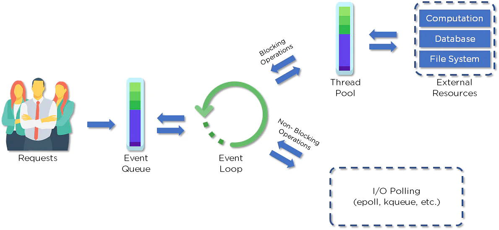

# Node.Js
## What is Node.Js?
Node.Js is an extremely powerful JavaScript runtime environment for running web applications outside the client's browser. Developers use Node.js to create server-side web applications, and it is perfect for data-intensive applications since it uses an asynchronous, event-driven model.

## What is event loop?
OK, The Event Loop allows nodejs to perform non-blocking io operations.

The Event Loop is a queue of callback functions. When an async 
function executes, the callback function is pushed into the queue. 
The JavaScript engine doesn't start processing the event loop until 
the code after an async function has been executed.
So even though nodejs is single thread. The event loop allows nodejs to still perform multiple operations.

https://nodejs.org/en/docs/guides/dont-block-the-event-loop/
## What do you understand about callbacks?
A callback is a function passed as an argument to another function.

callbacks are most often used with asynchronous functions.

For example, when you create a function to load a file, you cannot use the content before it is fully loaded. This is a good time to use a callback.

## What is callback hell?
callback hell is a problem that arises usually when developers try to implement asynchronous processes one after another.
There are a lot of ways to solve callback hell:
The general strategy is modularization. You can break up callbacks into independent functions.

You can also use async + await or generators + promises to avoid callback hell.

## What kind of framework has been used with node.js?
I'm familiar with Koa.js.
Koa is a very small framework that provides us with a minimal interface to build our applications. 
A Koa application is an object containing an array of middleware
functions that are composed and executed in a stack-like manner.

## pm2 ?
[](https://medium.com/we-code-we-write/why-and-how-you-should-use-pm2-for-a-node-js-application-in-production-5fa19dd3a856)
Automatic process restarts and keeping alive

assert 应用就结束了

PM2 enables you to keep applications alive forever, reloads them without downtime, helps you to manage application logging, monitoring, and clustering.

# Restful API

## What is the concept of statelessness in REST?

The REST architecture is designed in such a way that the client state is not maintained on the server. This is known as statelessness. The context is provided by the client to the server using which the server processes the client’s request.

## What are HTTP Status codes?
These are the standard codes that refer to the predefined status of the task at the server. Following are the status codes formats available:

1xx - represents informational responses (代表请求已被接受，需要继续处理)
2xx - represents successful responses
3xx - represents redirects
4xx - represents client errors
5xx - represents server errors

## What are the HTTP Methods?
POST - create
GET - read
PUT - Update
DELETE - Delete

除了POST都要设计成幂等的

# Database
## What databases are you familiar with?
I'm familiar with MongoDB.
MongoDB is a non-relational database. It stores data in the key-value pair. It doesn't have much structure but it's more flexible.

## Explain the term "indexing" in MongoDB.
Indexes help MongoDB to query faster.
An Index stores a small part of the data set in a form that is easy to traverse. The index stores the value of the specific field or set of fields, ordered by the value of the field as specified in the index.

## What do you mean by Transactions?
A transaction is a logical unit of processing in a database that includes one or more database operations, which can be read or write operations. Transactions provide a useful feature in MongoDB to ensure consistency.

## sql injection or nosql injection？

```
Example 

User.findOne({
    "name" : req.params.name, 
    "password" : req.params.password
}, callback); 

If req.params.password is { $ne: 1 }, the user will be 
retrieved without knowing the password ($ne means not 
equals 1).
```

use Mongoose Driver
As it follows a schema, if the password is a string field, it will convert the object { $ne: 1 } to string and no damage will be done. In this case, you don't need to sanitize, just remember to set a proper schema.


# Computer Science

## ground-up computer science
Whatever you enter into console is an expression, and whatever console gives you is a value.

variable
function
function call

## Thread pool


## Functions
# Security

# docker
[教程](https://docker.easydoc.net/)


Docker 是一个应用打包、分发、部署的工具

镜像：可以理解为软件安装包，可以方便的进行传播和安装。
容器：软件安装后的状态，每个软件运行环境都是独立的、隔离的，称之为容器。

目录挂载：直接把宿主机目录映射到容器内，适合挂载代码目录/配置文件

多容器通信：
1）一个容器先创建网络 2）另一个容器使用这个网络

Docker-Compose：
把项目的多个服务集合到一起 一键运行

## docker images?


## docker container?
Docker containers consist of applications and all their dependencies.
They share the kernel and system resources with other containers and run as isolated systems in the host operating system.

## DockerFile 
It is a text file that has all commands

## 

# K8S


# Micro Service

以前微服务之间是通过http相互通信的
每个微服务部署在一个docker容器里面 然后是怎么弄域名的哇


# unit Test
Mocha unit test


# Resume
## [Resume Template](https://www.beamjobs.com/)


# Reference:

[1] [Top 50+ Node.js Interview Questions and Answers for 2022](https://www.simplilearn.com/tutorials/nodejs-tutorial/nodejs-interview-questions)

[2] [What-is-node-js](https://www.simform.com/blog/what-is-node-js/#section2)


worker thread ?
数据库的话就是